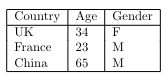

# markupquill
Tool to help write LaTeX

### Usage:
Creating a matrix with `-m` or `--matrix`
```bash
markupquill -m "
1 2 3
4 5 6"
```
gives you
```bash
\begin{bmatrix}1 & 2 & 3 \\ 4 & 5 & 6\end{bmatrix}
```

which is LaTex for

$$\begin{bmatrix}1 & 2 & 3 \\\\ 4 & 5 & 6\end{bmatrix}$$

You can also create a table with `-t` or `--table`
```bash
markupquill -t "
Country, Age, Gender
UK, 34, F
France, 23, M
China, 65, M"
```

Output:



### Installation:
```bash
git clone https://github.com/asgervelling/markupquill
cd markupquill
pip install .
```

In your LaTeX document, be sure to `\usepackage{amsmath}`.

### Testing
```bash
chmod +x run_tests.sh
# Install and run tests
./run_tests.sh -i
```
